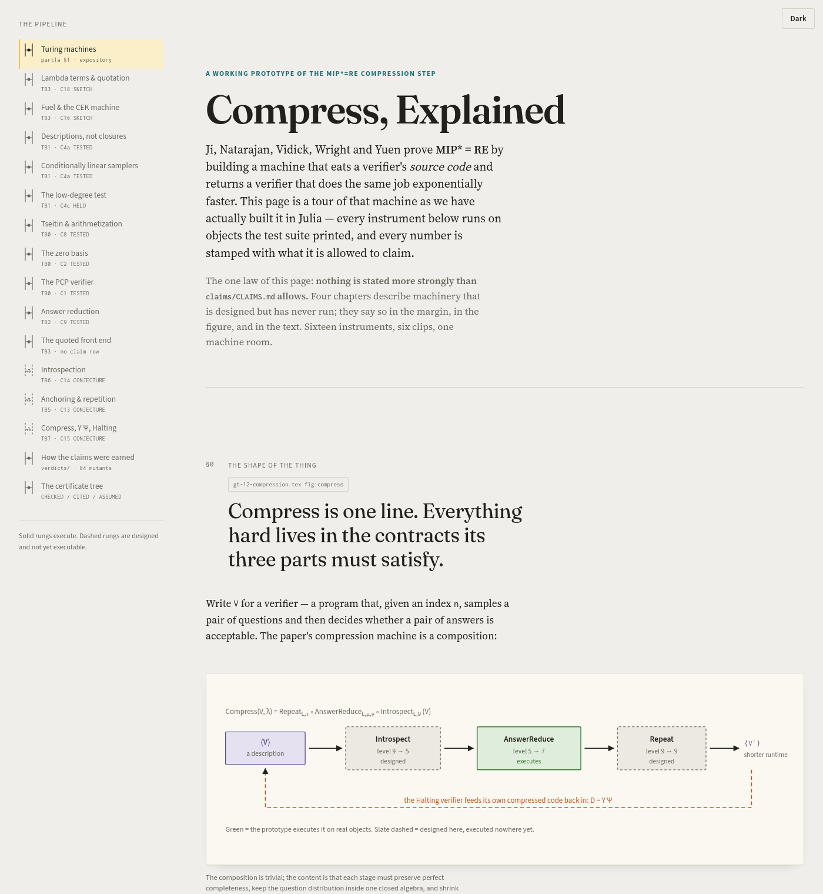

<div align="center">

# mipstar-lambda

**The compression step of MIP\* = RE, rebuilt as executable, certified transformations on verifier *descriptions* — and adversarially verified, claim by claim.**

[**▶ Open the interactive explainer**](https://tobiasosborne.github.io/mipstar-lambda/) · [the analytic document (PDF)](docs/analytic/analytic-underpinnings.pdf) · [the claims ratchet](claims/CLAIMS.md) · [the verdicts](verdicts/)

<a href="https://tobiasosborne.github.io/mipstar-lambda/"></a>

<sub>Julia 1.12 · no dependencies beyond the standard library · AGPL-3.0</sub>

</div>

---

## The idea in one paragraph

Ji, Natarajan, Vidick, Wright and Yuen prove [MIP\* = RE](https://arxiv.org/abs/2001.04383) with a machine that takes a verifier's **source code** and returns a verifier that does the same job exponentially faster:

```
Compress(V, λ)  =  Repeat ∘ AnswerReduce ∘ Introspect (V)
```

Apply it to a verifier that asks "does `M` halt?" and feed the compressed code back into itself through a fixed point `D = Y Ψ`, and deciding the game's value decides the halting problem. Everything hard lives in three contracts the stages must satisfy at once: perfect completeness is preserved, the question distribution stays inside one closed algebra of *conditionally linear* samplers, and runtime shrinks.

This repository builds that machine as **a small algebra of pure functions on quoted programs**, where every invariant the proof depends on (degrees, field size, variable dependence, sampler levels, description size, fuel) is tracked as data and checked by a certificate that can fail. What the paper proves analytically — Schwartz–Zippel, low-degree soundness, quantum rigidity — stays exactly where the paper puts it, carried as explicitly **CITED** leaves, never as proofs.

## What is built

The work climbs a ladder of *tracer bullets*: each rung is a thin end-to-end slice, verified before the next begins.

| Rung | What executes | Where the paper says it | State |
|---|---|---|---|
| **TB0** | GF(2ᵏ) arithmetic; sparse polynomials with two degree accounts; multilinear extensions; the NW19 Tseitin transform and formula-tree arithmetization; the zero-on-subcube certificate `c₀ = Σᵢ cᵢ · zero(zᵢ)` as an executable rewrite; the paper's `pcpverifier` on a real six-gate circuit over GF(8) and GF(2¹¹) | §10.4 | **converged** — critic r4 PASS · C1 C2 C3 C8 TESTED |
| **TB1** | Conditionally linear maps as an inductive datatype whose level *is* the nesting depth; the low-degree-test samplers `L_Point`, `L_ALine`, `L_DLine`; exact histograms over all 32,768 seeds; the decider `D^ld` | §4, §7 | critic r5 · C4a TESTED · one source-exactness fix in flight |
| **TB2** | The 18-type PCP sampler, the oracularized 54-type product, the five checks of the answer-reduced decider; every CL map serialized to canonical bytes with a decode round trip | §10.5 | critic r5 · C4b C9 TESTED · two replay cases in flight |
| **TB3** | Quoted program IR with canonical bytes and exact `description_size`; a fuel-metered CEK evaluator (`Value` / `OutOfFuel` / `SortError`, never throws); bounded trace → succinct 3SAT → decoupled 5SAT → the same PCP builder, on the *generated* description | §10.2–10.3 | repair r1 landed · critic r2 running · C10 proposed |
| **TB4** | `Compress` as a contract skeleton; `Hole`/`Specialize`/`YCode`; the halting verifier as the quoted fixed point `D_{M,λ} = Y Ψ_{M,λ}` | §12 | prerequisites landed · brief ready |
| **TB5 – TB7** | Description-level sampler algebra; anchoring and 81-fold repetition; the Pauli test and introspection with an exact stabilizer simulation; the full `Compress` on descriptions with a fail-visible toy policy | §8, §11, §12 | designed and critic-converged (DESIGN v2 r3 PASS) · briefs written |
| toy | The recursive midpoint protocol: optimal cheating probability exactly `1 − 2⁻ⁿ`; sequential repetition needs Θ(2ⁿ) copies | — | **PROVED** |

Numbers the suite prints and the explainer shows: 989 assertions, 97 registered mutants each shown to turn a test red, 27 critic verdicts, a Tseitin occurrence vector `(2,0,0,0,2,2,0,0,0,0,6,4,4,4,4,3)`, 2,736 of 2,916 answer-reduction type pairs that trigger no check, and one honest `ExpansionRefused(279,936 > 160,000)`.

## How the claims are earned

A status in [`claims/CLAIMS.md`](claims/CLAIMS.md) rises **only** inside a critic's verdict — never by the author. The loop:

1. A **proposer** builds a rung from a written brief in [`briefs/`](briefs/): red test first, then green, then a mutant for every new assertion.
2. An **adversarial critic** (a different model, working on an archived commit) recomputes every number from the ground-truth TeX with its own code, writes new mutants, and files a verdict in [`verdicts/`](verdicts/): numbered objections, each with a fix demand and the *surviving weaker statement*.
3. Repeat until no MAJOR objection remains. Objection counts fall monotonically or the design is wrong: the design took 13 → 3 → 1 → 0, TB0 took 7 → 5 → 1 → 0, the analytic document 11 → 6 → 0.
4. The **mutation runner** is baseline-first: a mutant is credited only if the unmutated target passes, so a broken test can never be mistaken for a kill.

Statuses: **PROVED** (adversarially verified derivation) · **TESTED** (machine-checked on explicit instances, red-capable) · **SKETCH** · **CONJECTURE** · **REFUTED** (kept as a negative result). Where the source as written does not typecheck, the code carries a `SOURCE_REPAIR` node instead of a silent fix.

### Two findings, stated softly

- **F1.** As we read the NW19 Tseitin gadget, a gate wire with fan-out *f* has individual degree `2 + 2f` after arithmetization, not 2 as `prop:tseitin-arith-degree` states; on the real six-gate circuit one variable reaches 6. The theorem survives with `(deg_F + 5d)·m′/q` and `d ≥ 7`. Our reading may be wrong; see [`docs/findings.md`](docs/findings.md).
- **F2.** NW19's Tseitin formula omits the output literal, so it is satisfiable for every input; the implementation adds `w_out`.

## Read, watch, run

- **[Compress, Explained](https://tobiasosborne.github.io/mipstar-lambda/)** — sixteen chapters, each with a live instrument on the repository's own objects: a Turing-machine tape, β-reduction with de Bruijn indices, the fuel meter, all 32,768 sampler questions in a three.js scene, the 54×54 guard map, the certificate tree, and a flythrough of the compression ladder. Nothing on it is stated more strongly than the claims table allows.
- **[Analytic underpinnings](docs/analytic/analytic-underpinnings.pdf)** — a 92-page document for physicists: Turing machines → λ-calculus → descriptions → the paper's machine model, with a figure on every page and its own critic loop (r3 PASS).
- **[`docs/DESIGN.md`](docs/DESIGN.md)** — the single source of definitions: the term language, the certificate grammar, the sampler-description API, and the executable design of Introspect, Repeat and Compress.
- **[`ground-truth/`](ground-truth/)** — verbatim TeX slices of arXiv:2001.04383v3, the only authority; code cites line ranges, never memory.

```bash
julia --project=. -e 'using Pkg; Pkg.instantiate()'
julia --project=. test/runtests.jl           # 989 assertions; the TB0 body is wall-clock gated
julia --project=. test/mutations/run.jl      # 97 mutants, each must exit non-zero
tools/cold_precompile.sh                     # cold image build time, reported separately
python3 tools/build_site.py                  # regenerate docs/index.html from the explainer
```

## Layout

```
src/            the algebra: fields, polynomials, circuits, samplers, verifiers, ir/, frontend/
test/           one file per rung; test/mutations/ holds the registered mutants and the runner
claims/         CLAIMS.md — the ratchet
verdicts/       every critic round, in full
briefs/         every work order and the proposer's report of record
docs/DESIGN.md  the design (single source); docs/definitions.md; docs/findings.md
docs/analytic/  the pdflatex document, its figures, and figstyle.tex (one visual system)
docs/tutorial/  the explainer (source of truth); docs/index.html is the built site
ground-truth/   the paper, sliced
```

## Status and lineage

Work is tracked in the repository itself: `HANDOFF.md` holds the current state, `worklog/` the day-by-day record. The method is `rk-light` (proposer / critic / ratchet / mutation), summarized at the top of [`CLAUDE.md`](CLAUDE.md). The construction is due to Ji, Natarajan, Vidick, Wright and Yuen; the errors are ours.

<sub>AGPL-3.0. Built with Claude Code as orchestrator, Claude Fable as proposer, Claude Opus as critic, and codex (gpt-5.6) as proposer in the early rungs.</sub>
